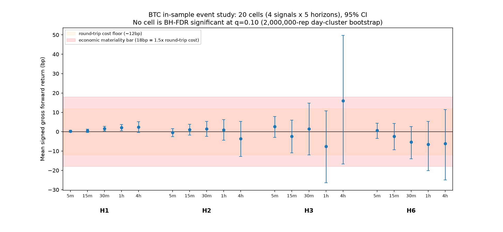
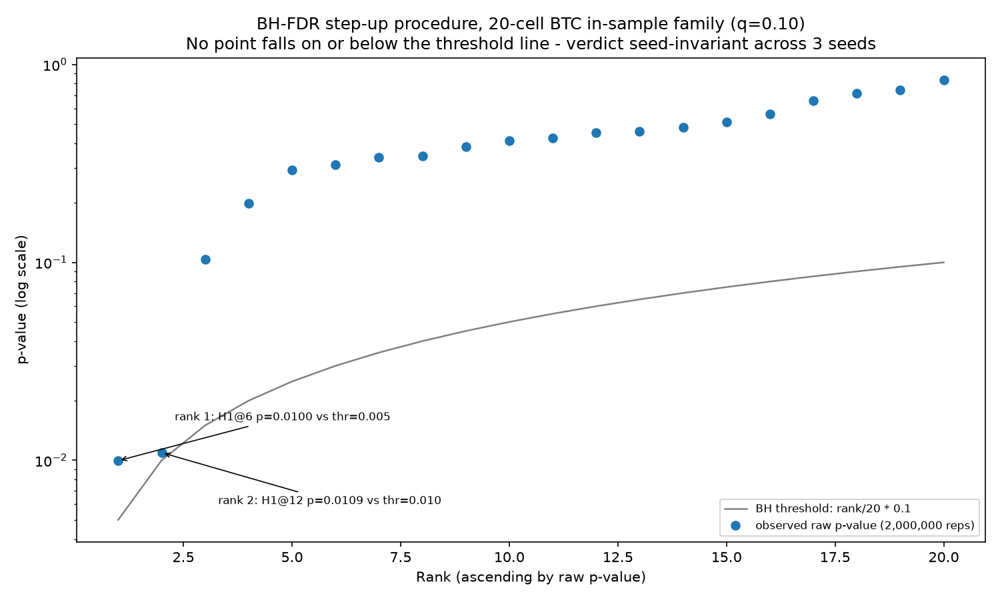
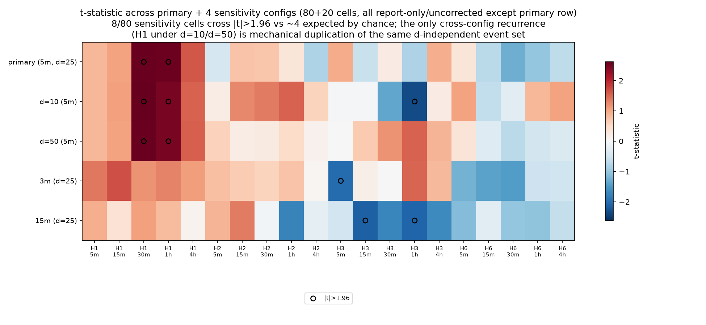
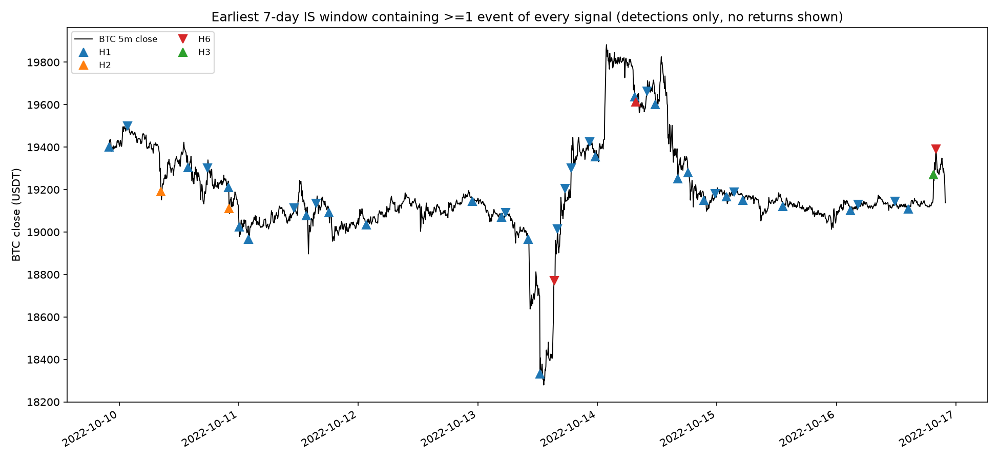

# Order Flow Research Engine v1

A confirmatory quantitative research project testing whether classic
order-flow footprint signals contain exploitable information in Binance
BTCUSDT perpetual futures, under a falsification-first, pre-registered
protocol. This is not a trading bot and ships no live strategy.

> **Question:** do six classic order-flow signals carry exploitable information in BTC perps?
> **Data:** 48 months Binance BTCUSDT+ETHUSDT perp aggTrades, ~54GB, checksum-verified, QA'd.
> **Method:** pre-registered falsification protocol - 20-cell family, BH-FDR q=0.10, day-cluster bootstrap at 2,000,000 reps, economic materiality gate at 1.5x costs.
> **Result:** 0/20 significant; 2 signals data-blocked (disclosed); zero promotions; OOS never opened.
> **Why it matters:** a certified negative at institutional rigor - the pipeline that produces it is the deliverable.

## Result


*Fig 1 - all 20 BTC in-sample cells (4 signals x 5 horizons), mean signed gross return with 95% CI against the round-trip cost floor and economic materiality bar. No cell is BH-FDR significant; H3's wide CIs are what underpowered looks like, not an axis-scaling artifact.*

Six classic order-flow signals were in scope. Two - **H4 (liquidity
wall)** and **H5 (liquidity pull)** - are **DATA-BLOCKED** for the entire
study: the official Binance historical archive carries no full-depth L2
order book history, and third-party vendors' free tiers (1st-of-month
samples only) are structurally insufficient for a confirmatory event
study. No claim of "no edge" is made for H4/H5; they are simply untested.
See [`preregistration/PREREGISTRATION.md`](preregistration/PREREGISTRATION.md#3-data-blocked-register--h4-h5)
section 3.

The remaining four - **H1 delta divergence, H2 absorption, H3 stacked
imbalance, H6 exhaustion** - were tested on BTCUSDT in-sample
(2022-07-01 to 2024-12-31) under the pre-registered 20-cell family (4
signals x 5 horizons), Benjamini-Hochberg FDR at q=0.10.

**Zero of 20 cells cleared BH-FDR significance. Zero of four signals were
promoted.** H3 (62 in-sample events) and H6 (286 events) additionally
failed the minimum-event-count gate (>=300) at the pre-registered
convention parameters - underpowered, not merely null.


*Fig 2 - Benjamini-Hochberg step-up procedure, 20-cell family. No point falls on or below the threshold line; the two nearest misses (H1 at 30m and 1h) are seed-invariant across 3 independent seeds at 2,000,000 reps.*

The most statistically credible cell in the entire table - the
highest-mean cell among those clearing raw p<0.05, before any FDR
correction - was **H1 at the 1-hour horizon, +2.1bp gross**. Against the
pre-registered materiality bar of 18bp (1.5x the ~12bp round-trip cost
floor: 5bp taker fee + slippage, each side), that cell sits roughly
**9x below** the threshold required to call it economically material -
before even factoring in that it does not survive multiplicity
correction. **This is a double null: informational (fails BH-FDR) and
economic (even the best cell falls far short of materiality).**

Because no signal was promoted:
- **The Phase 4 confirmatory backtest was not run.** There is nothing to
  confirm.
- **The out-of-sample segment (2025-01-01 to 2026-06-30) was not
  touched by any event-return statistic** - not descriptively, not for
  completeness. Promotion gates exist precisely to decide what is
  allowed to see OOS data; nothing cleared them, so OOS remains reserved
  and clean for any future pre-registered follow-up.
- **ETH replication was not run** (promoted-signals-only per the
  prereg). The ETH bar store was ingested and passed the same Phase 2 QA
  as BTC.
- **No Deflated Sharpe Ratio is reported for a strategy**, because there
  is no promoted strategy to deflate. The declared trial count (N=140)
  is disclosed anyway, for transparency about the full scope of what was
  computed.

A **report-only sensitivity grid** (4 one-factor-at-a-time configs:
Delta=10, Delta=50, bar=3m, bar=15m; 80 further uncorrected cells) shows
the null is not an artifact of the primary 5-minute/Delta=25 convention:
8 of 80 cells cross |t|>1.96, close to what independent chance alone
would predict at this scale, and none of the pattern is consistent
across configs. See `reports/sensitivity_grid.md` for the full tables
and the mandatory interpretation preamble governing how (and how not) to
read them.


*Fig 3 - t-statistic across the primary convention + 4 sensitivity configs, all 20 cells. 8/80 sensitivity cells cross |t|>1.96 vs ~4 expected by chance; the only cross-config recurrence (H1 under Delta=10/Delta=50) is mechanical duplication of the same Delta-independent event set.*

A **circular-shift placebo** (non-gating, K=10,000 shifts per signal -
see the Rigor coverage matrix below) mostly agrees with the day-cluster
bootstrap, but diverges on H6: the bootstrap resamples H6's actual event
days and so inherits the high-dispersion state H6 conditions on (P95
volume), while the placebo relocates the same event pattern to typical
states, producing a tighter null. The placebo is therefore
anti-conservative for a state-conditioned signal like H6 - exactly why
the pre-registered gates run on the bootstrap, not the placebo. **H6's
placebo-flagged sign is negative** (h=6: -5.4bp, h=12: -6.6bp): read as
possible *contrarian* alignment (fading the exhaustion signal), not
support for H6 as originally hypothesized. No multiplicity correction is
applied to the placebo column - it is a diagnostic, and at K=10,000 its
smallest values carry the same kind of Monte Carlo granularity the
precision amendment above exists to eliminate from the primary family.
Full mechanism discussion and the disagreement table in
`reports/event_study_btc.md`.

Full numeric detail: [`reports/FINAL_REPORT.md`](reports/FINAL_REPORT.md)
(assembled from the runner-generated artifacts of every phase - nothing
in it is hand-typed).

**This is a clean negative result. It is the intended and fully
acceptable outcome of a falsification-first study**, not a setback. Future
work on these four signals means a new pre-registered study on unseen
data - not a re-run of this one with adjusted thresholds. No gate, window,
or threshold in this repository should be read as a candidate for
loosening; see [`ROADMAP.md`](ROADMAP.md) for what legitimate next steps
look like (new hypotheses, new data, not relaxed rules).

## Scope and limitations

**What a null here does and does not falsify.** The operationalizations
tested are the retail-accessible, footprint-chart versions of these
concepts - 5-minute bars built from trades-derived footprints, horizons
of 5 minutes to 4 hours, taker-side execution economics. Order flow as
monetized by market-making and latency-sensitive firms is a different
object: sub-second horizons, full-book state (queue position,
replenishment, cancellations), maker economics - requiring exactly the
L2 history that is data-blocked for this study. A null at this study's
scale falsifies the footprint-lore versions at retail-accessible
timescales and costs; it does not falsify, and cannot speak to,
microstructure alpha at the tick scale. The v1.5 collector (in-repo)
exists to make that layer testable in the future.

- **Single-instrument discovery, single-venue prints.** BTCUSDT perp on
  Binance only; no cross-venue consolidated tape. ETH ingested but
  reserved for promotion-gated replication that never triggered.
- **H2 is a proxy.** Absorption was tested via its trades-footprint
  operationalization (high opposing volume at a level, price refusal);
  the stricter book-refill definition (resting liquidity replenishing
  while hit) needs L2 and partially inherits the H4/H5 data block.
- **One operationalization per concept.** Each fuzzy practitioner
  concept was frozen into a single pre-registered definition (plus
  scaled variants in the sensitivity grid). Other operationalizations
  remain untested; any future variant requires its own pre-registered
  study, not a post-hoc redefinition here.
- **Execution model.** Taker both sides. Maker entry would roughly halve
  fees but introduces fill/adverse-selection risk not modeled; no claim
  is made in either direction.
- **Regime composition.** The IS window (2022H2-2024) has its own regime
  mix; the year-consistency gate mitigates but does not eliminate regime
  dependence.

## Rigor coverage matrix

So a reviewer doesn't have to ask: where this study sits against the
standard quantitative-robustness checklist, and why each N/A is actually
N/A rather than skipped.

| Test | Status |
|---|---|
| Bootstrap resampling | **Done, precision-amended:** day-cluster bootstrap, 2,000,000 reps (raised from the originally pre-registered 10,000 - [`preregistration/DEVIATIONS.md`](preregistration/DEVIATIONS.md) entry 1), respects intraday clustering and serial dependence, seed-invariance verified across 3 independent seeds. [`reports/event_study_btc.md`](reports/event_study_btc.md) (Cells + Seed invariance sections). |
| Permutation / placebo | **Done:** circular-shift placebo, a drift-absorbing null that tests event-return *alignment* net of market beta rather than the existence of drift itself - the one failure channel (bull-market beta masquerading as signal) the bootstrap alone doesn't isolate. Additive, non-gating supplement - [`preregistration/DEVIATIONS.md`](preregistration/DEVIATIONS.md) entry 2, [`reports/event_study_btc.md`](reports/event_study_btc.md) (Circular-shift placebo section). |
| Monte Carlo PnL reshuffling | **N/A - no promoted strategy exists to reshuffle.** The pre-registered spec (stationary block bootstrap on daily PnL, block length 5 days, 10,000 reps) is fully written for any future promoted strategy - [`preregistration/PREREGISTRATION.md`](preregistration/PREREGISTRATION.md) section 7. |
| Walk-forward re-optimization | **N/A by design, not by omission.** Zero fitted parameters exist in this study - every detector threshold is a fixed convention value, never fit to data - so the failure mode walk-forward re-optimization guards against (parameter overfitting) is precluded structurally. A purge (= h\*'s bar length) + 1-day embargo walk-forward evaluation is pre-specified for any promoted strategy's OOS confirmation - [`preregistration/PREREGISTRATION.md`](preregistration/PREREGISTRATION.md) section 7. |
| Parameter robustness grid | **Done:** 80-cell one-factor-at-a-time sensitivity grid (Delta=10, Delta=50, bar=3m, bar=15m) - plateau-of-the-null evidence, 8 of 80 cells cross \|t\|>1.96 against a ~4-cell chance expectation. [`reports/sensitivity_grid.md`](reports/sensitivity_grid.md). |
| Cost stress escalation | **Inverted case, structurally moot rather than separately tested:** BH-FDR significance in the Cells table is computed on gross (pre-cost) forward returns - costs enter only through the separate materiality gate (gate 3), never the significance test itself. The 0/20 BH-FDR outcome is therefore identical at any round-trip cost assumption, including zero; it is not a byproduct of the ~12bp cost estimate being too pessimistic. [`reports/event_study_btc.md`](reports/event_study_btc.md), [`preregistration/PREREGISTRATION.md`](preregistration/PREREGISTRATION.md) section 6.6. |
| Crisis / regime stress | **Covered by design, not a bolt-on test:** the sample spans the 2022 LUNA/FTX collapses, 2023 banking stress, and the 2024-08 carry-unwind crash; the pre-registered year-consistency gate (gate 4) is the regime-stability check, and [`reports/event_counts_by_half_year.md`](reports/event_counts_by_half_year.md) documents the calendar distribution of events across those regimes. No promoted strategy exists, so there is no strategy-level crash-PnL to report. |
| Noise injection | **Not informative for a null result** (noise can destroy real structure, it cannot manufacture a signal that survives BH-FDR) - not run for that reason, not omitted by oversight. The dominant footprint-specific noise channel, bucket-boundary placement, is already covered by the Delta=10/Delta=50 sensitivity configs. [`reports/sensitivity_grid.md`](reports/sensitivity_grid.md). |
| Cross-timeframe | **Done:** 3-minute and 15-minute bar configs, both report-only sensitivity, both consistent with the primary null. [`reports/sensitivity_grid.md`](reports/sensitivity_grid.md). |
| Cross-instrument | **Deliberately withheld, not skipped:** ETH replication is promotion-gated by the prereg - running it on signals that never cleared BTC discovery would spend the one reserved confirmation universe for zero confirmatory value. The ETH bar store exists and passed the identical Phase 2 QA gate as BTC. [`preregistration/PREREGISTRATION.md`](preregistration/PREREGISTRATION.md) section 7, [`reports/QA_SUMMARY.md`](reports/QA_SUMMARY.md). |
| Blind hold-out | **Held in the strictest state achievable:** the 18-month OOS segment (2025-01-01 to 2026-06-30) is locked, single-use, and was never opened by any event-return computation - not descriptively, not for completeness - because nothing earned access. [`reports/FINAL_REPORT.md`](reports/FINAL_REPORT.md) section 3. |
| Look-ahead / leakage tests | **Done:** a dedicated truncation-invariance pytest suite for every detector, plus a next-bar-open execution convention throughout (an event is only actionable using the bar close that revealed it). [`tests/test_truncation_invariance.py`](tests/test_truncation_invariance.py). |
| Multiplicity control | **Done:** Benjamini-Hochberg FDR at q=0.10 over a declared, closed 20-cell family; total trial count N=140 declared for Deflated Sharpe Ratio purposes regardless of there being no promoted strategy to deflate. [`reports/event_study_btc.md`](reports/event_study_btc.md), [`reports/FINAL_REPORT.md`](reports/FINAL_REPORT.md) section 3. |
| Reproducibility | **Done:** deterministic seeding throughout (`orderflow.stats.stable_seed`), byte-identical output across repeated runs, and - new in the precision amendment - BH-significance seed-invariance verified across 3 independent seeds at 2,000,000 reps. [`preregistration/DEVIATIONS.md`](preregistration/DEVIATIONS.md) entries 1-2, [`reports/event_study_btc.md`](reports/event_study_btc.md) (Seed invariance section). |

## Methodology


*Fig 4 - one 7-day BTC in-sample window with at least one detection of every signal (H1/H2/H3/H6), markers only, no forward returns shown - the window choice cannot cherry-pick outcomes (deterministic rule: earliest such window; see `runners/phase5_figures.py`).*

**Pre-registration before PnL.** Every hypothesis, event definition,
parameter, horizon, statistical gate, and cost assumption is frozen in
[`preregistration/PREREGISTRATION.md`](preregistration/PREREGISTRATION.md),
committed before any code touched a forward return or PnL figure. The
document went through one substantive review round before sign-off,
recorded in its own Appendix A rather than as a post-hoc deviation
(the largest change: replacing an underspecified "best horizon" concept
with a fully deterministic two-step rule, below). No definition changed
after sign-off; `preregistration/DEVIATIONS.md` is the log for any that
would have, and is empty.

**Promotion is two decoupled, mechanical steps - built, and never fired
in this study:**
1. **Gate 3 (does an edge exist):** define the eligible-horizon set
   `E(signal)` = every horizon that is simultaneously BH-FDR significant,
   >=30 minutes, and clears the 18bp materiality bar. Gate 3 passes iff
   this set is non-empty. This is a pure existence test with no tie-break
   sensitivity.
2. **h\* selection (which horizon is traded):** for any signal passing
   gates 1-3, `h* = argmax` over `E(signal)` of the day-cluster-bootstrap
   t-statistic, ties toward the longer horizon - fully deterministic, no
   discretion at write-up time. h\* alone then governs the year-consistency
   gate and, had any signal reached it, the Phase 4 backtest exit,
   OOS confirmation, and ETH replication horizon.

Splitting "does an edge exist" from "which horizon" this way removes what
would otherwise be the last post-hoc degree of freedom in the promotion
decision. Neither step ever activated here - every signal failed gate 2
(BH-FDR) before gate 3 was reached - but the machinery is real, tested,
and documented for the next study that might clear it.

**FDR family.** Exactly the 20 BTC in-sample cells (4 signals x 5
horizons), Benjamini-Hochberg at q=0.10. Out-of-sample and ETH cells are
confirmatory follow-ups for already-promoted signals, deliberately outside
this family - standard discovery-vs-confirmation separation, moot here
since discovery produced no promotions.

**Day-cluster bootstrap.** Every p-value and confidence interval resamples
*calendar days* (not individual events) with replacement, 2,000,000
repetitions (precision amendment - `preregistration/DEVIATIONS.md` entry
1; originally pre-registered at 10,000), respecting intraday event
clustering and serial dependence - the concrete implementation of a
stationary block bootstrap. The resampling is seeded deterministically
(`orderflow.stats.stable_seed`, a `zlib.crc32`-based seed) after a real
reproducibility bug was found mid-review: Python's built-in `hash()` on a
tuple is randomized per process by default, so an earlier version of this
pipeline silently produced different p-values on every run from identical
data. Two full runs now produce byte-identical output; BH-significance is
additionally verified seed-invariant across 3 independent seeds at the
amended rep count.

**Segment purging.** An event is admitted into a segment's (IS or OOS)
statistics only if its *longest* tested horizon's forward window closes
entirely within that same segment - decided once per event, not once per
horizon, so every horizon of a given signal-cell always shares an
identical event set and no horizon comparison is confounded by a shifting
sample.

**Quarantine.** A confirmed exchange-side data gap on 2022-09-06 (both
BTC and ETH, ending within 10 milliseconds of each other - see the
data-engineering section below) is excluded from event formation, and any
forward-return window overlapping it is nulled
(`src/orderflow/quarantine.py`). This runs *before* deduplication, so a
quarantined event can never have already suppressed a legitimate nearby
one through the 6-bar dedup rule.

**Costs.** 5bp taker fee + slippage (half-spread, negligible for BTC,
plus a 1bp impact buffer) per side, ~12bp round trip; historical funding
applied to any position crossing a funding timestamp, signed by side.
Stated prominently because it is the dominant null-generating force for
short-horizon order-flow signals - see the headline result above.

**Multiplicity.** Deflated Sharpe Ratio trial count N=140 = 20 (BTC
in-sample) + 20 (BTC out-of-sample, would-have-been) + 20 (ETH
replication, would-have-been) + 80 (sensitivity grid). Declared in full
regardless of whether a promoted strategy exists to apply it to.

## Data engineering

Phase 2 QA surfaced three real data-quality issues, each caught by a
check that existed specifically to catch it - worth documenting because
none of them were hypothetical:

**An exchange-side partial-day gap, 2022-09-06.** The daily-vs-klines
volume reconciliation flagged both BTCUSDT and ETHUSDT as short that day.
Investigation traced it to the raw `aggTrades` archive itself - both the
monthly *and* daily Binance archives - not an artifact of ingestion: the
`agg_trade_id` sequence jumps by 31,646 (BTC) and 94,136 (ETH) across a
window that, for BTC, runs 17:14:36-17:20:57 UTC and for ETH,
17:09:34-17:20:57 UTC. Both windows end within **10 milliseconds** of
each other - a strong signature of a shared exchange-side event, not two
independent archive artifacts. Not repairable by re-splicing (the daily
archive has the identical hole), so the affected bars are quarantined
rather than backfilled: excluded from event formation, with any
forward-return window overlapping the gap nulled.

**A monthly-vs-daily same-ID, different-quantity revision.** Ten days in
ETHUSDT 2023-05 reconciled short against klines. The first repair attempt
- concatenate the daily archive onto the monthly trades and deduplicate
by `agg_trade_id` - appeared to succeed but left the reconciliation diff
completely unchanged. Direct comparison showed why: the monthly and daily
archives contained the *exact same* 782,735 trade IDs for one of the
affected days, but disagreed on the reported quantity for those IDs (an
apparent Binance revision between when the two archives were generated).
Deduplicating by ID alone silently kept whichever copy was listed first -
the stale monthly one. Fixed by dropping the target day's monthly-sourced
rows entirely before splicing in the daily archive's values, rather than
merging at the trade level; the daily archive has matched klines almost
exactly in every cross-check run during this audit, so it is treated as
authoritative for any day being repaired. A regression test reproduces
the exact same-ID-different-quantity scenario.

**Ten whole-day monthly-archive gaps.** Five BTC and five ETH months
(clustered in 2022-08 through 2023-05 - an early-archive-era pattern, not
a recurring one across the full 48-month period) had the monthly
`aggTrades` rollup missing specific calendar days entirely, while the
corresponding daily archive files were complete. All ten were backfilled
by splicing in the daily files.

**Provenance.** `data/manifest.json` records the sha256, byte size, and
ingestion timestamp of every file this pipeline ever downloaded,
including both the original monthly zip and any daily backfill zips for
a repaired month. `data/qa_backfill_log.jsonl` and
`data/qa_breach_classification.jsonl` are the per-month and per-day
record of what was found and how it was resolved; both feed directly
into `reports/QA_SUMMARY.md`'s classification table and totals, so the
QA report and the underlying evidence never drift apart.

The reconciliation gate closed as **PASS-WITH-EXCEPTIONS**: every
outstanding breach day resolved to either `KLINES_HOLE` (aggTrades
independently verified complete against its own daily archive; klines
was the deficient source) or the quarantined upstream gap above - zero
`UNEXPLAINED` days. Full per-day table in `reports/QA_SUMMARY.md`.

One further parsing issue was found and fixed, not gating: some
`bookDepth` archive days format the percentage-band column as a float
string (`"-5.00"`) instead of an integer string (`"-5"`), which broke the
original `Int64`-typed reader. `bookDepth` is descriptive-only per the
prereg (never a signal input), so this never blocked confirmatory work;
fixed anyway (`orderflow.etl.read_bookdepth` now reads it as `Float64`
and rounds/casts), with a regression test.

## Repository layout

```
orderflow-research-engine/
|-- README.md                  # this file
|-- ROADMAP.md
|-- docs/BRIEF.md               # verbatim original project brief
|-- preregistration/
|   |-- PREREGISTRATION.md      # frozen spec, signed off before any PnL
|   `-- DEVIATIONS.md           # 2 entries: precision amendment, placebo supplement
|-- src/orderflow/               # etl, footprint, signals/h1-h6, eventstudy, stats, costs, quarantine, figures
|-- collector/depth_recorder.py # v1.5 L2 recorder (see ROADMAP.md)
|-- runners/                    # phase runners; each emits reports/ artifacts
|-- tests/                      # 104 tests: unit, truncation-invariance, integration, figure smoke tests
|-- reports/                    # runner-generated, immutable (includes reports/figures/)
`-- data/                       # gitignored except manifest.json
```

## Reproducing this study

```
python -m venv .venv && .venv/Scripts/activate  # or source .venv/bin/activate
pip install -r requirements.txt
pytest tests/                                    # should show 104 passed
python runners/phase2_etl.py                     # full 48-month, 2-symbol ingest (~1hr, ~54GB download)
python runners/phase2_qa.py                      # QA gate
python runners/phase3_event_study.py             # the 20-cell BTC in-sample study
python runners/phase3_sensitivity_stage.py       # Delta=10 / bar=3m re-staging
python runners/phase3_sensitivity_derive.py      # Delta=50 / bar=15m derivation
python runners/phase3_sensitivity_run.py         # the 80-cell sensitivity grid
python runners/phase5_final_report.py            # assembles reports/FINAL_REPORT.md
python runners/phase5_figures.py                 # renders reports/figures/*.png for this README
```

Every `runners/phase*.py` script is independently re-runnable and
regenerates its `reports/*.md` / `reports/*.csv` output deterministically
from the same input data.

## Related research

Part of a systematic research series applying the same falsification-first
protocol across asset classes and strategy families:

- [`multi-asset-tsmom-research`](https://github.com/AaroNLaU0307/multi-asset-tsmom-research) - time-series momentum across asset classes, **confirmed** (net Sharpe ~0.70-0.75, bootstrap CI excludes zero); XSMOM and four overlay studies falsified under the same gates.
- [`quant-backtest-framework`](https://github.com/AaroNLaU0307/quant-backtest-framework) - multi-instrument SMC/ICT price-action study, **falsified** (0/16 cells, DSR ~ 0).

The series' base rate is the point: confirmations are earned against the same gates that falsify everything else.
